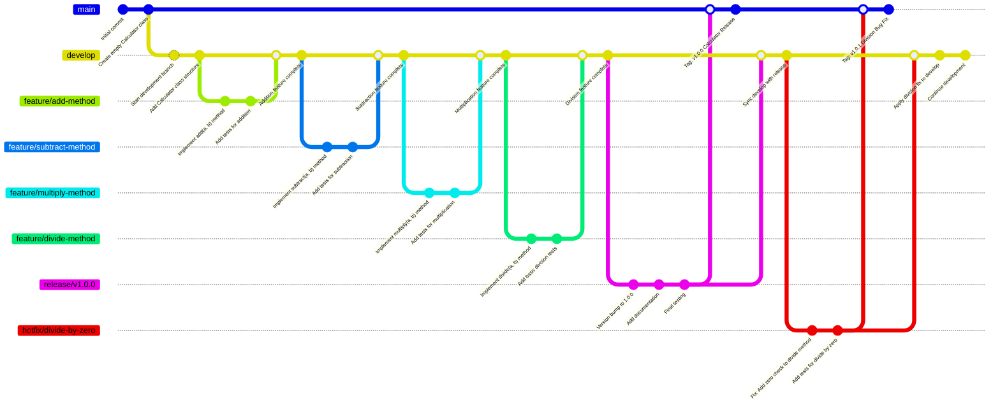

# GitFlow Strategy

This document defines the Git workflow strategy, based on the GitFlow model with a staging and pre-production branch, structured bug-handling approach, regression testing, and CI/CD integration.

---

## 🔁 Branch Structure

| Branch       | Purpose                                           |
|--------------|---------------------------------------------------|
| `main`       | Production-ready code                             |
| `pre-prod`   | Pre-production environment for release approval   |
| `staging`    | UAT/Staging environment for business testing      |
| `dev`        | Integration of feature branches                   |
| `feature/*`  | New features                                       |
| `bugfix/*`   | Bugs found in staging, dev, or feature branches   |
| `release/*`  | Pre-release branch for stabilization              |
| `hotfix/*`   | Urgent fixes for production                       |

---

## 📊 Branch Flow Diagram (Mermaid)

```mermaid
graph TD
    A[feature/*] --> B[dev]
    B --> C[release/*]
    C --> D[staging]
    D --> E[pre-prod]
    E --> F[main]
    F -->|tag| G[Production]

    subgraph Hotfix Flow
      H[hotfix/*] --> F
      H --> B
      H --> D
      H --> E
    end

    subgraph Bugfix Flow
      X[bugfix/*] --> C
      X --> B
      X --> D
      X --> E
    end
````

---

## 🚀 CI/CD Rules

| Branch     | Pipeline                                                 |
| ---------- | -------------------------------------------------------- |
| `dev`      | Lint, Unit Tests                                         |
| `staging`  | Integration Tests, Regression Testing, Deploy to UAT     |
| `pre-prod` | Smoke Tests, Business Sign-off, Deploy to Pre-production |
| `main`     | Deploy to Production                                     |

---

## 🛠️ Feature Workflow

```bash
git checkout dev
git checkout -b feature/new-login
# make changes
git push origin feature/new-login
```

* Create a pull request to `dev`
* Conduct code review
* Merge after approval

---

## 🐞 Bug-Finding & Fixing Strategy

### Found in Local Development

* Fix directly in `feature/*`

### Found in Code Review

* Reviewer flags issue → developer updates `feature/*` branch

### Found in CI/CD

* CI fails → developer fixes and re-pushes

### Found in QA on Feature

```bash
git checkout feature/<name>
git checkout -b bugfix/fix-from-feature
# fix
git push origin bugfix/fix-from-feature
```

PR to `staging` and `dev`

### Found in Staging (Regression Testing)

```bash
git checkout release/vX.X.X
git checkout -b bugfix/uat-issue
# fix
git push origin bugfix/uat-issue
```

PR to `release/*`, then merge into `staging` and `dev`

### Found in Pre-Production

```bash
git checkout pre-prod
git checkout -b bugfix/preprod-issue
# fix
git push origin bugfix/preprod-issue
```

PR to `pre-prod`, then merge to `staging` and `dev`

### Found in Production

```bash
git checkout main
git checkout -b hotfix/crash-fix
# fix
git push origin hotfix/crash-fix
```

PR to `main`, then merge to `pre-prod`, `staging`, `dev`

---

## 🔁 Regression Testing

**Purpose**: Ensure new changes do not break existing functionality.

### When:

* After merging to `release/*`
* After bugfixes in `staging`
* Before merging to `pre-prod` and `main`

### Includes:

* Previously fixed bugs
* Critical workflows
* Automated integration tests
* Smoke testing

### Setup:

* Run in CI pipeline for `staging`, `pre-prod`
* Log in test tools like TestRail
* Mandatory before every release

---

## ⏪ Rollback Strategy

In case of failure:

```bash
git revert <bad_commit>
git push origin main
```

Then merge into `pre-prod`, `staging`, `dev`

---

## 📦 Release Process

```bash
git checkout dev
git checkout -b release/v1.2.0
# finalize work
git push origin release/v1.2.0
```

QA on `staging`
Regression tests
Then:

```bash
git checkout pre-prod
git merge release/v1.2.0
```

After approval:

```bash
git checkout main
git merge pre-prod
git tag v1.2.0
git push origin main --tags

git checkout dev
git merge main
```

---

## 🔒 Branch Protections

| Branch     | Protection Rules                                 |
| ---------- | ------------------------------------------------ |
| `main`     | PR required, 2 reviewers, CI pass, tag required  |
| `pre-prod` | PR required, QA & business sign-off, smoke tests |
| `staging`  | PR required, QA approval, regression validation  |
| `dev`      | PR required, CI pass                             |

---

## 📛 Naming Conventions

| Type    | Example                 |
| ------- | ----------------------- |
| Feature | feature/user-onboarding |
| Bugfix  | bugfix/fix-button-crash |
| Release | release/v1.2.0          |
| Hotfix  | hotfix/payment-error    |

---

## 🧪 Example: `Calculator` Git History



---

## 🔁 Summary Flow

* `feature/*` → `dev`
* `bugfix/*` → `release/*`, `staging`, `pre-prod`, `dev`
* `release/*` → `staging` → `pre-prod` → `main` → `tag` → `dev`
* `hotfix/*` → `main` → `pre-prod`, `staging`, `dev`

---