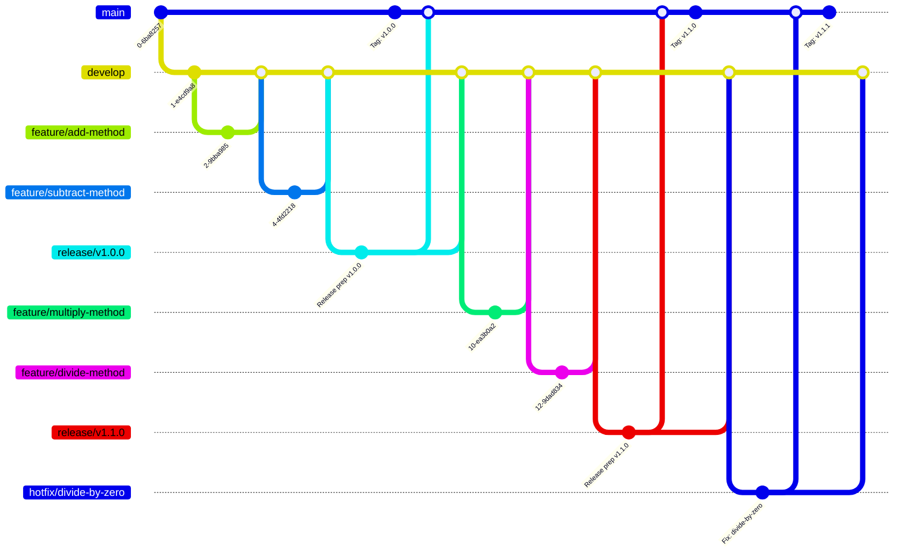

# GitFlow Strategy

## 1. GitFlow Branching Strategy

We use the GitFlow workflow to manage features, releases, and hotfixes. The main branches are:

- **main**: Production-ready code.
- **develop**: Latest development changes.
- **feature/**: New features (e.g., `feature/add-method`).
- **release/**: Release preparation (e.g., `release/v1.0.0`).
- **hotfix/**: Critical fixes for production (e.g., `hotfix/divide-by-zero`).

### Example Flow



**Summary:**
- Features are developed in `feature/` branches, merged into `develop`.
- Releases are prepared in `release/` branches, merged into both `main` and `develop`.
- Hotfixes are made in `hotfix/` branches, merged into both `main` and `develop`.

---

## 2. How to Run the App

Assuming a FastAPI app:

```bash
uv pip install -r requirements.txt
uvicorn app.main:app --reload
```

- The API will be available at `http://localhost:8000`.

---

## 3. How to Run Tests

Assuming tests are in a `tests/` directory and use `pytest`:

```bash
uv pip install -r requirements.txt
pytest
```

---

## 4. Example Test Cases

Suppose the calculator API exposes endpoints for add, subtract, multiply, and divide.

**Example: `tests/test_calculator.py`**

```python
import pytest
from fastapi.testclient import TestClient
from app.main import app

client = TestClient(app)

def test_add():
    response = client.post("/add", json={"a": 2, "b": 3})
    assert response.status_code == 200
    assert response.json() == {"result": 5}

def test_subtract():
    response = client.post("/subtract", json={"a": 5, "b": 2})
    assert response.status_code == 200
    assert response.json() == {"result": 3}

def test_multiply():
    response = client.post("/multiply", json={"a": 4, "b": 3})
    assert response.status_code == 200
    assert response.json() == {"result": 12}

def test_divide():
    response = client.post("/divide", json={"a": 10, "b": 2})
    assert response.status_code == 200
    assert response.json() == {"result": 5}

def test_divide_by_zero():
    response = client.post("/divide", json={"a": 10, "b": 0})
    assert response.status_code == 400
    assert response.json()["detail"] == "Division by zero is not allowed"
```

---

## 5. Summary

- Use GitFlow for structured development.
- Run the app with `uvicorn`.
- Run tests with `pytest`.
- Add new features in `feature/` branches, prepare releases in `release/`, and fix production bugs in `hotfix/`.